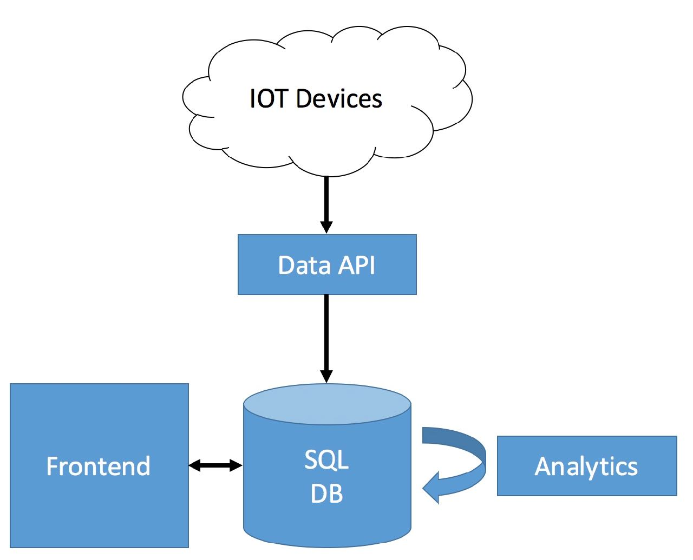
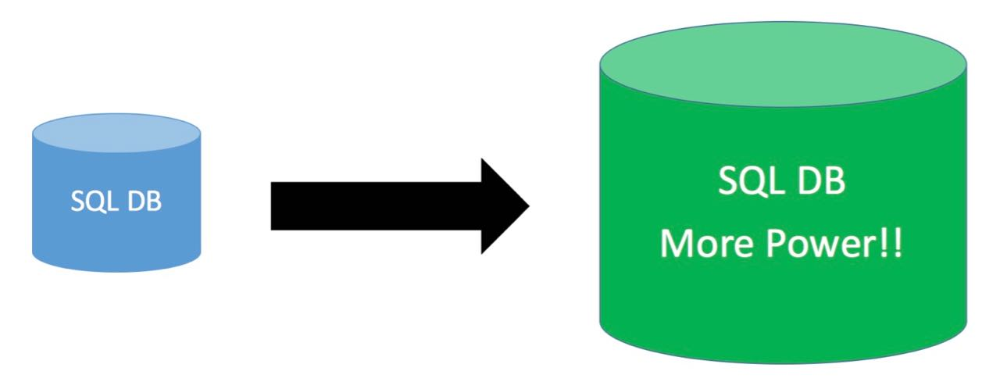
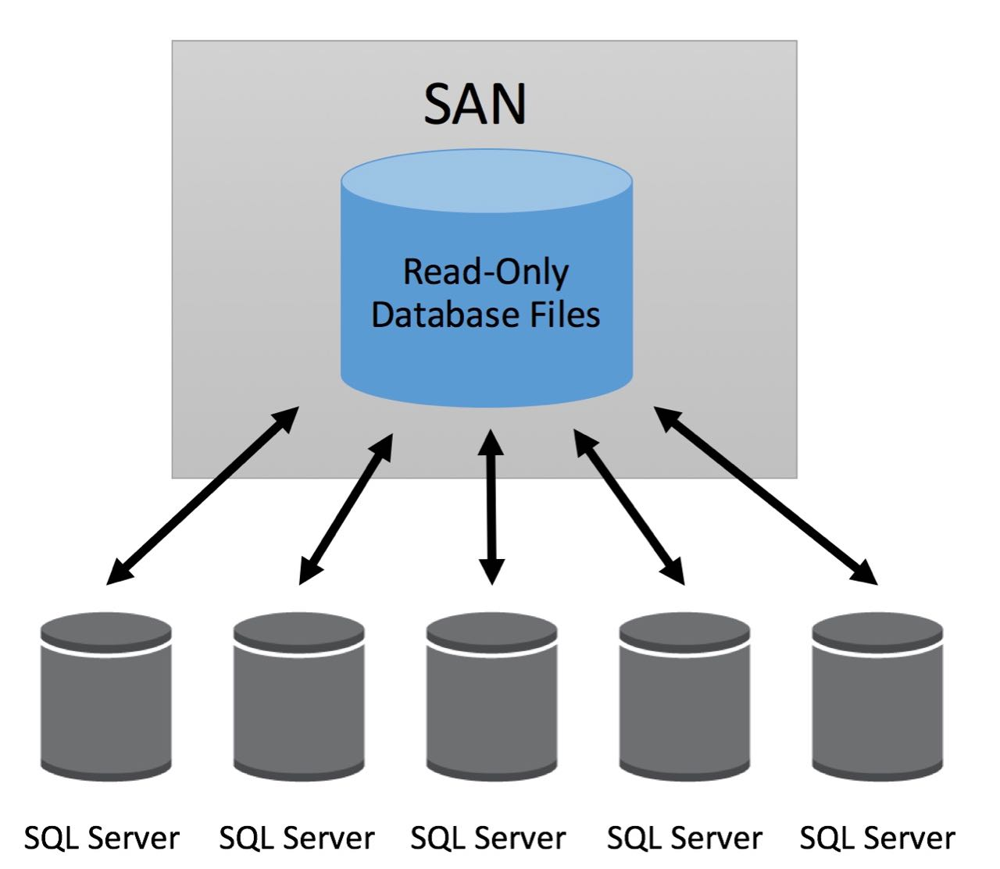
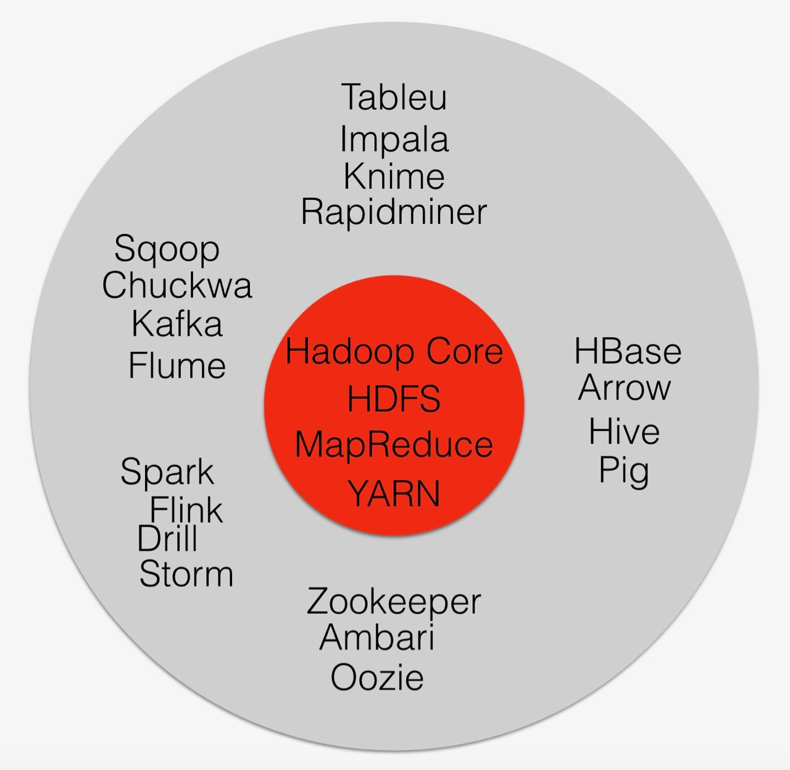
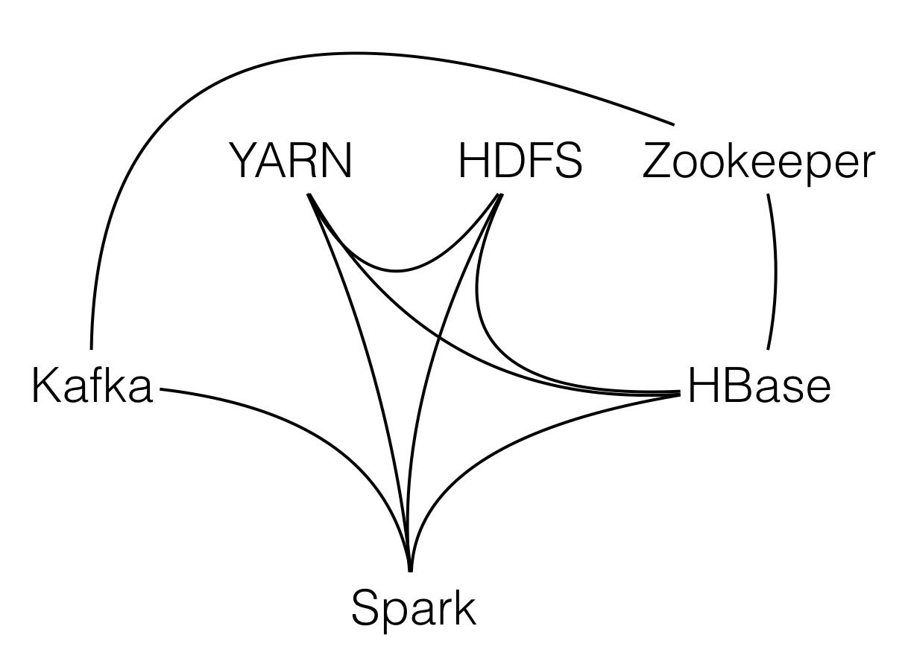
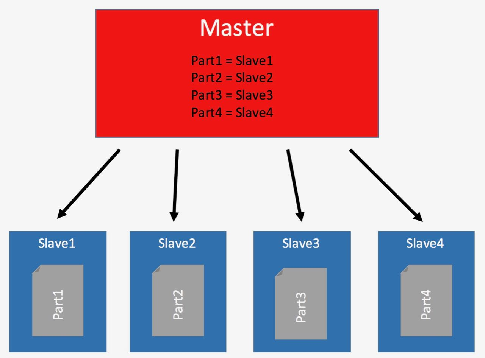
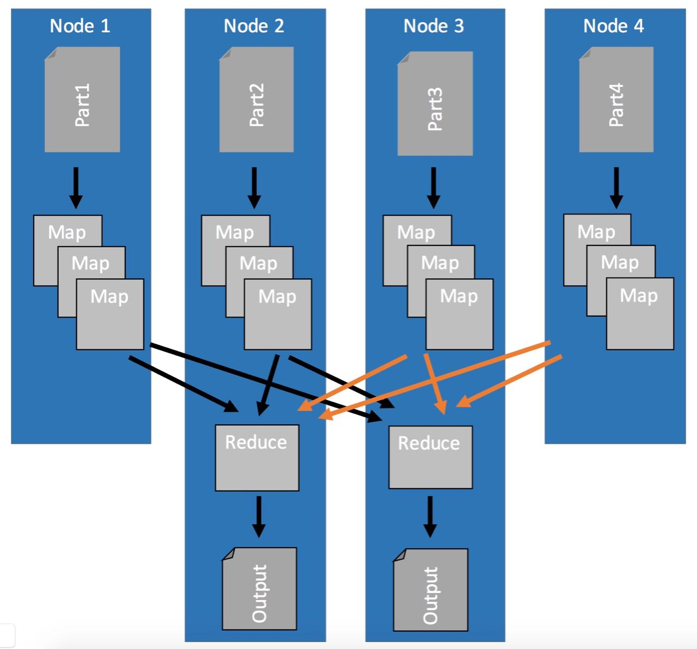
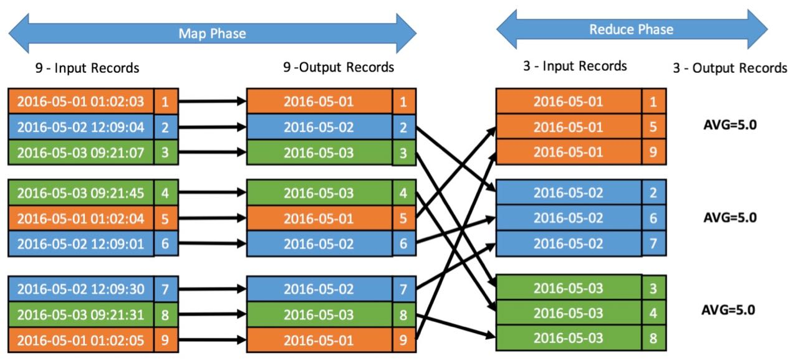
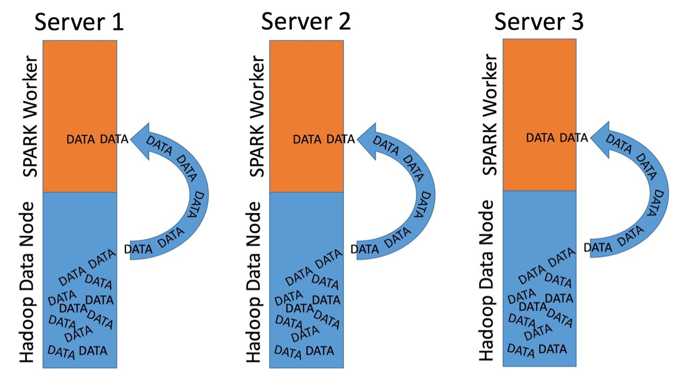
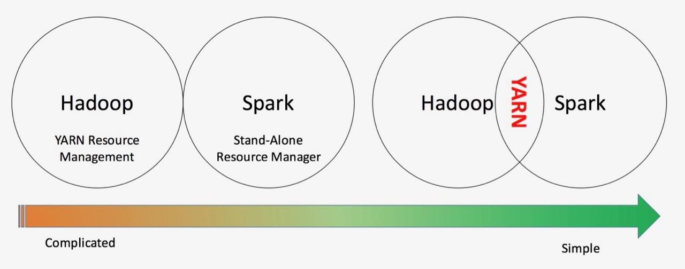

Advanced Data Engineering Skills
================================

## Contents

- [Big Data](AdvancedSkills.md#big-data)
  - [What is Big Data](AdvancedSkills.md#what-is-big-data)
  - [The 4 Vs of Big Data](AdvancedSkills.md#the-4-vs-of-big-data)
  - [Why Big Data](AdvancedSkills.md#why-big-data)
    - [Planning is Everything](AdvancedSkills.md#planning-is-everything)
    - [The Problem with ETL](AdvancedSkills.md#the-problem-with-etl)
    - [Scaling Up](AdvancedSkills.md#scaling-up)
    - [Scaling Out](AdvancedSkills.md#scaling-out)
    - [When not to Do Big Data](AdvancedSkills.md#please-dont-go-big-data)
- [Data Science Platform](AdvancedSkills.md#data-science-platform)
  - [Why a Good Data Platform Is Important](AdvancedSkills.md#why-a-good-data-platform-is-important)
  - [Lambda Architecture](AdvancedSkills.md#lambda-architecture)
  - [Batch Processing](AdvancedSkills.md#batch-processing)
  - [Stream Processing](AdvancedSkills.md#stream-processing)
  - [Should You do Stream or Batch Processing](AdvancedSkills.md#should-you-do-stream-or-batch-processing)
  - [Kappa Architecture](AdvancedSkills.md#kappa-architecture)
- [Data Warehouse vs Data Lake](AdvancedSkills.md#data-warehouse-vs-data-lake)
- [Hadoop Platforms](AdvancedSkills.md#hadoop-platforms)
  - [What is Hadoop](AdvancedSkills.md#what-is-hadoop)
  - [What makes Hadoop so popular](AdvancedSkills.md#what-makes-hadoop-so-popular)
  - [Hadoop Ecosystem Components](AdvancedSkills.md#hadoop-ecosystem-components)
  - [Hadoop is Everywhere?](AdvancedSkills.md#hadoop-is-everywhere)
  - [Should You Learn Hadoop?](AdvancedSkills.md#should-you-learn-hadoop)
  - [How to Select Hadoop Cluster Hardware](AdvancedSkills.md#how-to-select-hadoop-cluster-hardware)
- [Docker](AdvancedSkills.md#docker)
  - [What is Docker and How it Works](AdvancedSkills.md#what-is-docker-and-what-do-you-use-it-for)
    -  [Don't Mess Up Your System](AdvancedSkills.md#dont-mess-up-your-system)
    - [Preconfigured Images](AdvancedSkills.md#preconfigured-images)
    - [Take it With You](AdvancedSkills.md#take-it-with-you)
    - [Kubernetes Container Deployment](AdvancedSkills.md#kubernetes-container-deployment)
    - [How to Create Start and Stop a Container](AdvancedSkills.md#how-to-create-start-stop-a-container)
    - [Docker Micro Services](AdvancedSkills.md#docker-micro-services)
    - [Kubernetes](AdvancedSkills.md#kubernetes)
    - [Why and How To Do Docker Container Orchestration](AdvancedSkills.md#why-and-how-to-do-docker-container-orchestration)
    - [Userful Docker Commands](AdvancedSkills.md#useful-docker-commands)
- [REST APIs](AdvancedSkills.md#rest-apis)
  - [API Design](AdvancedSkills.md#api-design)
  - [Implemenation Frameworks](AdvancedSkills.md#implementation-frameworks)
  - [Security](AdvancedSkills.md#security)
- [Databases](AdvancedSkills.md#databases)
  - [SQL Databases](AdvancedSkills.md#sql-databases)
    - [PostgreSQL DB](AdvancedSkills.md#postgresql-db)
    - [Database Design](AdvancedSkills.md#database-design)
    - [SQL Queries](AdvancedSkills.md#sql-queries)
    - [Stored Procedures](AdvancedSkills.md#stored-procedures)
    - [ODBC/JDBC Server Connections](AdvancedSkills.md#odbc-jdbc-server-connections)
  - [NoSQL Stores](AdvancedSkills.md#nosql-stores)
    - [HBase KeyValue Store](AdvancedSkills.md#keyvalue-stores-hbase)
    - [HDFS Document Store](AdvancedSkills.md#document-stores-hdfs)
    - [MongoDB Document Store](AdvancedSkills.md#document-stores-mongodb)
    - [Elasticsearch Document Store](AdvancedSkills.md#Elasticsearch-search-engine-and-document-store)
    - [Hive Warehouse](AdvancedSkills.md#hive-warehouse)
    - [Impala](AdvancedSkills.md#impala)
    - [Kudu](AdvancedSkills.md#kudu)
    - [Apache Druid](AdvancedSkills.md#apache-druid)
    - [InfluxDB Time Series Database](AdvancedSkills.md#influxdb-time-series-database)
    - [Greenplum MPP Database](AdvancedSkills.md#mpp-databases-greenplum)
- [Data Processing and Analytics](AdvancedSkills.md#data-processing-and-analytics)
  - [Is ETL still relevant for Analytics?](AdvancedSkills.md#is-etl-still-relevant-for-analytics)
  - [Stream Procesing](AdvancedSkills.md#stream-processing)
    - [Three Methods of Streaming](AdvancedSkills.md#three-methods-of-streaming)
    - [At Least Once](AdvancedSkills.md#at-least-once)
    - [At Most Once](AdvancedSkills.md#at-most-once)
    - [Exactly Once](AdvancedSkills.md#exactly-once)
    - [Check The Tools](AdvancedSkills.md#check-the-tools)
  - [MapReduce](AdvancedSkills.md#mapreduce)
    - [How Does MapReduce Work](AdvancedSkills.md#How-does-mapreduce-work)
    - [MapReduce](AdvancedSkills.md#mapreduce)
    - [MapReduce Example](AdvancedSkills.md#example)
    - [MapReduce Limitations](AdvancedSkills.md#What-is-the-limitation-of-mapreduce)
  - [Apache Spark](AdvancedSkills.md#apache-spark)
    - [What is the Difference to MapReduce?](AdvancedSkills.md#what-is-the-difference-to-MapReduce)
    - [How Spark Fits to Hadoop](AdvancedSkills.md#how-does-spark-fit-to-hadoop)
    - [Spark vs Hadoop](AdvancedSkills.md#wheres-the-difference)
    - [Spark and Hadoop a Perfect Fit](AdvancedSkills.md#spark-and-hadoop-is-a-perfect-fit)
    - [Spark on YARn](AdvancedSkills.md#spark-on-yarn)
    - [My Simple Rule of Thumb](AdvancedSkills.md#my-simple-rule-of-thumb)
    - [Available Languages](AdvancedSkills.md#available-languages)
    - [Spark Driver Executor and SparkContext](AdvancedSkills.md#how-spark-works-driver-executor-sparkcontext)
    - [Spark Batch vs Stream processing](AdvancedSkills.md#spark-batch-vs-stream-processing)
    - [How Spark uses Data From Hadoop](AdvancedSkills.md#How-does-spark-use-data-from-hadoop)
    - [What are RDDs and How to Use Them](AdvancedSkills.md#what-are-rdds-and-how-to-use-them)
    - [SparkSQL How and Why to Use It](AdvancedSkills.md#available-languages)
    - [What are Dataframes and How to Use Them](AdvancedSkills.md#what-are-dataframes-how-to-use-them)
    - [Machine Learning on Spark (TensorFlow)](AdvancedSkills.md#machine-learning-on-spark-tensor-flow)
    - [MLlib](AdvancedSkills.md#mllib)
    - [Spark Setup](AdvancedSkills.md#spark-setup)
    - [Spark Resource Management](AdvancedSkills.md#spark-resource-management)
  - [Apache Nifi](AdvancedSkills.md#apache-nifi)
  - [StreamSets](AdvancedSkills.md#streamsets)
  - [Apache Kafka](AdvancedSkills.md#apache-kafka)
    - [Why a Message Queue Tool?](AdvancedSkills.md#why-a-message-queue-tool)
    - [Kafka Architecture](AdvancedSkills.md#kafka-architecture)
    - [Kafka Topics](AdvancedSkills.md#what-are-topics)
    - [Kafka and Zookeeper](AdvancedSkills.md#what-does-zookeeper-have-to-do-with-kafka)
    - [How to Produce and Consume Messages](AdvancedSkills.md#how-to-produce-and-consume-messages)
    - [Kafka Commands](AdvancedSkills.md#kafka-commands)
  - [Machine Learning](AdvancedSkills.md#machine-learning)
    - [How to do Machine Learning in production](AdvancedSkills.md#how-to-domachine-learning-in-production)
    - [Why machine learning in production is harder then you think](AdvancedSkills.md#why-machine-learning-in-production-is-harder-then-you-think)
    - [Models Do Not Work Forever](AdvancedSkills.md#models-do-not-work-forever)
    - [Where are The Platforms That Support Machine Learning](AdvancedSkills.md#where-are-the-platforms-that-support-this)
    - [Training Parameter Management](AdvancedSkills.md#training-parameter-management)
    - [How to Convince People That Machine Learning Works](AdvancedSkills.md#how-to-convince-people-machine-learning-works)
    - [No Rules No Physical Models](AdvancedSkills.md#no-rules-no-physical-models)
    - [You Have The Data. Use It!](AdvancedSkills.md#you-have-the-data-use-it)
    - [Data is Stronger Than Opinions](AdvancedSkills.md#data-is-stronger-than-opinions)
    - [AWS Sagemaker](AdvancedSkills.md#aws-sagemaker)
- [Data Visualization](AdvancedSkills.md#data-visualization)
  - [Android and IOS](AdvancedSkills.md#android-and-ios)
  - [API Design for Mobile Apps](AdvancedSkills.md#how-to-design-apis-for-mobile-apps)
  - [Webservers](AdvancedSkills.md#how-to-use-webservers-to-display-content)
    - [Tomcat](AdvancedSkills.md#tomcat)
    - [Jetty](AdvancedSkills.md#jetty)
    - [NodeRED](AdvancedSkills.md#nodered)
    - [React](AdvancedSkills.md#react)
  - [Business Intelligence Tools](AdvancedSkills.md#business-intelligence-tools)
    - [Tableau](AdvancedSkills.md#tableau)
    - [Power BI](AdvancedSkills.md#power-bi)
    - [Quliksense](AdvancedSkills.md#quliksense)
  - [Identity & Device Management](AdvancedSkills.md#Identity-and-device-management)
    - [What Is A Digital Twin](AdvancedSkills.md#what-is-a-digital-twin)
    - [Active Directory](AdvancedSkills.md#active-directory)

## Big Data

### What is big data and where is the difference to data science and data analytics?

I talked about the difference in this podcast:
<https://anchor.fm/andreaskayy/embed/episodes/BI-vs-Data-Science-vs-Big-Data-e199hq>

### The 4 Vs of Big Data

It is a complete misconception. Volume is only one part of the often
called four V's of big data: Volume, velocity, variety and veracity.

**Volume** is about the size - How much data you have

**Velocity** is about the speed - How fast data is getting to you

How much data in a specific time needs to get processed or is coming
into the system. This is where the whole concept of streaming data and
real-time processing comes in to play.

**Variety** is about the variety - How different your data is

Like CSV files, PDFs that you have and stuff in XML. That you also have
JSON logfiles, or data in some kind of a key-value store.

It's about the variety of data types from different sources that you
basically want to join together. All to make an analysis based on that
data.

**Veracity** is about the credibility - How reliable your data is

The issue with big data is, that it is very unreliable.

You cannot really trust the data. Especially when you're coming from the
Internet of Things (IoT) side. Devices use sensors for measurement of
temperature, pressure, acceleration and so on.

You cannot always be hundred percent sure that the actual measurement is
right.

When you have data that is from for instance SAP and it contains data
that is created by hand you also have problems. As you know we humans
are bad at inputting stuff.

Everybody articulates different. We make mistakes, down to the spelling
and that can be a very difficult issue for analytics.

I talked about the 4Vs in this podcast:
<https://anchor.fm/andreaskayy/embed/episodes/4-Vs-Of-Big-Data-Are-Enough-e1h2ra>

### Why Big Data?

What I always emphasize is the four V's are quite nice. They give you a
general direction.

There is a much more important issue: Catastrophic Success.

What I mean by catastrophic success is, that your project, your startup
or your platform has more growth that you anticipated. Exponential
growth is what everybody is looking for.

Because with exponential growth there is the money. It starts small and
gets very big very fast. The classic hockey stick curve:

1, 2, 4, 8, 16, 32, 64, 128, 256, 512, 1024, 2048, 4096, 8192, 16384,
.... BOOM!

Think about it. It starts small and quite slow, but gets very big very
fast.

You get a lot of users or customers who are paying money to use your
service, the platform or whatever. If you have a system that is not
equipped to scale and process the data the whole system breaks down.

That's catastrophic success. You are so successful and grow so fast that
you cannot fulfill the demand anymore. And so you fail and it's all
over.

It's now like you just can make that up while you go. That you can
foresee in a few months or weeks the current system doesn't work
anymore.

#### Planning is Everything

It's all happens very very fast and you cannot react anymore. There's a
necessary type of planning and analyzing the potential of your business
case necessary.

Then you need to decide if you actually have big data or not.

You need to decide if you use big data tools. This means when you
conceptualize the whole infrastructure it might look ridiculous to
actually focus on big data tools.

But in the long run it will help you a lot. Good planning will get a lot
of problems out of the way, especially if you think about streaming data
and real-time analytics.

#### The problem with ETL

A typical old-school platform deployment would look like the picture
below. Devices use a data API to upload data that gets stored in a SQL
database. An external analytics tool is querying data and uploading the
results back to the SQL DB. Users then use the user interface to display
data stored in the database.

Now, when the front end queries data from the SQL database the following
three steps happen:

\- The database extracts all the needed rows from the storage. (E) - The
extracted data gets transformed, for instance sorted by timestamp or
something a lot more complex. (T) - The transformed data is loaded to
the destination (the user interface) for chart creation. (L)

With exploding amounts of stored data the ETL process starts being a
real problem.

Analytics is working with large data sets, for instance whole days,
weeks, months or more. Data sets are very big like 100GB or Terabytes.
That means Billions or Trillions of rows.

This has the result that the ETL process for large data sets takes
longer and longer. Very quickly the ETL performance gets so bad it won't
deliver results to analytics anymore.

A traditional solution to overcome these performance issues is trying to
increase the performance of the database server. That's what's called
scaling up.

#### Scaling Up

To scale up the system and therefore increase ETL speeds administrators
resort to more powerful hardware by:

Speeding up the extract performance by adding faster disks to physically
read the data faster. Increasing RAM for row caching. What is already in
memory does not have to be read by slow disk drives. Using more powerful
CPU's for better transform performance (more RAM helps here as well).
Increasing or optimising networking performance for faster data delivery
to the front end and analytics.

In summary: Scaling up the system is fairly easy.

But with exponential growth it is obvious that sooner or later (more
sooner than later) you will run into the same problems again. At some
point you simply cannot scale up anymore because you already have a
monster system, or you cannot afford to buy more expensive hardware.

The next step you could take would be scaling out.

#### Scaling Out

Scaling out is the opposite of scaling up. Instead of building bigger
systems the goal is to distribute the load between many smaller systems.

The easiest way of scaling out an SQL database is using a storage area
network (SAN) to store the data. You can then use up to eight SQL
servers (explain), attach them to the SAN and let them handle queries.
This way load gets distributed between those eight servers.

One major downside of this setup is that, because the storage is shared
between the SQL servers, it can only be used as an read only database.
Updates have to be done periodically, for instance once a day. To do
updates all SQL servers have to detach from the database. Then, one is
attaching the DB in read-write mode and refreshing the data. This
procedure can take a while if a lot of data needs to be uploaded.

This Link (missing) to a Microsoft MSDN page has more options of scaling
out an SQL database for you.

I deliberately don't want to get into details about possible scaling out
solutions. The point I am trying to make is that while it is possible to
scale out SQL databases it is very complicated.

There is no perfect solution. Every option has its up- and downsides.
One common major issue is the administrative effort that you need to
take to implement and maintain a scaled out solution.

#### Please don't go Big Data

If you don't run into scaling issues please, do not use big data tools!

Big data is a expensive thing. A Hadoop cluster for instance needs at
least five servers to work properly. More is better.

Believe me this stuff costs a lot of money.

Especially when you are talking about maintenance and development on top
big data tools into account.

If you don't need it it's making absolutely no sense at all!

On the other side: If you really need big data tools they will save your
ass :)

## Data Science Platform

### Why a Good Data Platform Is Important

| Podcast Episode: #066 How To Do Data Science From A Data Engineers Perspective  
|------------------|
|A simple introduction how to do data science in the context of the internet of things.
| [Watch on YouTube](https://youtu.be/yp_cc4R0mGQ) \ [Listen on Anchor](https://anchor.fm/andreaskayy/episodes/066-How-To-Do-Data-Science-From-A-Data-Engineers-Perspective-e45imt)|

### Lambda Architecture

| Podcast Episode: #077 Lambda Architecture and Kappa Architecture
|------------------|
|In this stream we talk about the lambda architecture with stream and batch processing as well as a alternative the Kappa Architecture that consists only of streaming. Also Data engineer vs data scientist and we discuss Andrew Ng’s AI Transformation Playbook.  
| [Watch on YouTube](https://youtu.be/iUOQPyHN9-0) \ [Listen on Anchor](https://anchor.fm/andreaskayy/episodes/077-Lambda--Kappa-Architecture-e45j0r)|

### Batch Processing

Ask the big questions. Remember your last yearly tax statement?

You break out the folders. You run around the house searching for the
receipts.

All that fun stuff.

When you finally found everything you fill out the form and send it on
its way.

Doing the tax statement is a prime example of a batch process.

Data comes in and gets stored, analytics loads the data from storage and
creates an output (insight):

Batch processing is something you do either without a schedule or on a
schedule (tax statement). It is used to ask the big questions and gain
the insights by looking at the big picture.

To do so, batch processing jobs use large amounts of data. This data is
provided by storage systems like Hadoop HDFS.

They can store lots of data (petabytes) without a problem.

Results from batch jobs are very useful, but the execution time is high.
Because the amount of used data is high.

It can take minutes or sometimes hours until you get your results.

### Stream Processing

Gain instant insight into your data.

Streaming allows users to make quick decisions and take actions based on
"real-time" insight. Contrary to batch processing, streaming processes
data on the fly, as it comes in.

With streaming you don't have to wait minutes or hours to get results.
You gain instant insight into your data.

In the batch processing pipeline, the analytics was after the data
storage. It had access to all the available data.

Stream processing creates insight before the data storage. It has only
access to fragments of data as it comes in.

As a result the scope of the produced insight is also limited. Because
the big picture is missing.

Only with streaming analytics you are able to create advanced services
for the customer. Netflix for instance incorporated stream processing
into Chuckwa V2.0 and the new Keystone pipeline.

One example of advanced services through stream processing is the
Netflix "Trending Now" feature. Check out the Netflix case study.

### Should you do stream or batch processing?

It is a good idea to start with batch processing. Batch processing is
the foundation of every good big data platform.

A batch processing architecture is simple, and therefore quick to set
up. Platform simplicity means, it will also be relatively cheap to run.

A batch processing platform will enable you to quickly ask the big
questions. They will give you invaluable insight into your data and
customers.

When the time comes and you also need to do analytics on the fly, then
add a streaming pipeline to your batch processing big data platform.

### Kappa Architecture with Kudu

## Data Warehouse vs Data Lake

| Podcast Episode: #055 Data Warehouse vs Data Lake
|------------------|
|On this podcast we are going to talk about data warehouses and data lakes? When do people use which? What are the pros and cons of both? Architecture examples for both Does it make sense to completely move to a data lake?
| [Watch on YouTube](https://youtu.be/8gNQTrUUwMk) \ [Listen on Anchor](https://anchor.fm/andreaskayy/episodes/055-Data-Warehouse-vs-Data-Lake-e45iem)|

## Hadoop Platforms

When people talk about big data, one of the first things come to mind is
Hadoop. Google's search for Hadoop returns about 28 million results.

It seems like you need Hadoop to do big data. Today I am going to shed
light onto why Hadoop is so trendy.

You will see that Hadoop has evolved from a platform into an ecosystem.
Its design allows a lot of Apache projects and 3rd party tools to
benefit from Hadoop.

I will conclude with my opinion on, if you need to learn Hadoop and if
Hadoop is the right technology for everybody.

### What is Hadoop

Hadoop is a platform for distributed storing and analyzing of very large
data sets.

Hadoop has four main modules: Hadoop common, HDFS, MapReduce and YARN.
The way these modules are woven together is what makes Hadoop so
successful.

The Hadoop common libraries and functions are working in the background.
That's why I will not go further into them. They are mainly there to
support Hadoop's modules.

| Podcast Episode: #060 What Is Hadoop And Is Hadoop Still Relevant In 2019?
|------------------|
|An introduction into Hadoop HDFS, YARN and MapReduce. Yes, Hadoop is still relevant in 2019 even if you look into serverless tools.
| [Watch on YouTube](https://youtu.be/8AWaht3YQgo) \ [Listen on Anchor](https://anchor.fm/andreaskayy/episodes/060-What-Is-Hadoop-And-Is-Hadoop-Still-Relevant-In-2019-e45ijp)|

### What makes Hadoop so popular?

Storing and analyzing data as large as you want is nice. But what makes
Hadoop so popular?

Hadoop's core functionality is the driver of Hadoop's adoption. Many
Apache side projects use it's core functions.

Because of all those side projects Hadoop has turned more into an
ecosystem. An ecosystem for storing and processing big data.

To better visualize this eco system I have drawn you the following
graphic. It shows some projects of the Hadoop ecosystem who are closely
connected with the Hadoop.

It is not a complete list. There are many more tools that even I don't
know. Maybe I am drawing a complete map in the future.

### Hadoop Ecosystem Components

Remember my big data platform blueprint? The blueprint has four stages:
Ingest, store, analyse and display.

Because of the Hadoop ecosystem the different tools in these stages can
work together perfectly.

Here's an example:

You use Apache Kafka to ingest data, and store the it in HDFS. You do
the analytics with Apache Spark and as a backend for the display you
store data in Apache HBase.

To have a working system you also need YARN for resource management. You
also need Zookeeper, a configuration management service to use Kafka and
HBase

As you can see in the picture below each project is closely connected to
the other.

Spark for instance, can directly access Kafka to consume messages. It is
able to access HDFS for storing or processing stored data.

It also can write into HBase to push analytics results to the front end.

The cool thing of such ecosystem is that it is easy to build in new
functions.

Want to store data from Kafka directly into HDFS without using Spark?

No problem, there is a project for that. Apache Flume has interfaces for
Kafka and HDFS.

It can act as an agent to consume messages from Kafka and store them
into HDFS. You even do not have to worry about Flume resource
management.

Flume can use Hadoop's YARN resource manager out of the box.

### Hadoop Is Everywhere?

Although Hadoop is so popular it is not the silver bullet. It isn't the
tool that you should use for everything.

Often times it does not make sense to deploy a Hadoop cluster, because
it can be overkill. Hadoop does not run on a single server.

You basically need at least five servers, better six to run a small
cluster. Because of that. the initial platform costs are quite high.

One option you have is to use a specialized systems like Cassandra,
MongoDB or other NoSQL DB's for storage. Or you move to Amazon and use
Amazon's Simple Storage Service, or S3.

Guess what the tech behind S3 is. Yes, HDFS. That's why AWS also has the
equivalent to MapReduce named Elastic MapReduce.

The great thing about S3 is that you can start very small. When your
system grows you don't have to worry about S3's server scaling.

### Should you learn Hadoop?

Yes, I definitely recommend you to get to know how Hadoop works and how
to use it. As I have shown you in this article, the ecosystem is quite
large.

Many big data projects use Hadoop or can interface with it. That's why
it is generally a good idea to know as many big data technologies as
possible.

Not in depth, but to the point that you know how they work and how you
can use them. Your main goal should be to be able to hit the ground
running when you join a big data project.

Plus, most of the technologies are open source. You can try them out for
free.

### How does a Hadoop System architecture look like

### What tools are usually in a with Hadoop Cluster

Yarn Zookeeper HDFS Oozie Flume Hive

### How to select Hadoop Cluster Hardware

Docker
------

### What is docker and what do you use it for

Have you played around with Docker yet? If you're a data science learner
or a data scientist you need to check it out!

It's awesome because it simplifies the way you can set up development
environments for data science. If you want to set up a dev environment
you usually have to install a lot of packages and tools.

#### Don't Mess Up Your System

What this does is you basically mess up your operating system. If you're
a starter you don't know which packages you need to install. You don't
know which tools you need to install.

If you want to for instance start with Jupyter notebooks you need to
install that on your PC somehow. Or you need to start installing tools
like PyCharm or Anaconda.

All that gets added to your system and so you mess up your system more
and more and more. What Docker brings you, especially if you're on a Mac
or a Linux system is simplicity.

#### Preconfigured Images

Because it is so easy to install on those systems. Another cool thing
about docker images is you can just search them in the Docker store,
download them and install them on your system.

Running them in a completely pre-configured environment. You don't need
to think about stuff, you go to the Docker library you search for Deep
Learning, GPU and Python.

You get a list of images you can download. You download one, start it
up, you go to the browser hit up the URL and just start coding.

Start doing the work. The only other thing you need to do is bind some
drives to that instance so you can exchange files. And then that's it!

There is no way that you can crash or mess up your system. It's all
encapsulated into Docker. Why this works is because Docker has natively
access to your hardware.

#### Take It With You

It's not a completely virtualized environment like a VirtualBox. An
image has the upside that you can take it wherever you want. So if
you're on your PC at home use that there.

Make a quick build, take the image and go somewhere else. Install the
image which is usually quite fast and just use it like you're at home.

It's that awesome!

### Kubernetes Container Deployment

I am getting into Docker a lot more myself. For a bit different reasons.

What I'm looking for is using Docker with Kubernetes. With Kubernetes
you can automate the whole container deployment process.

The idea with is that you have a cluster of machines. Lets say you have
a 10 server cluster and you run Kubernetes on it.

Kubernetes lets you spin up Docker containers on-demand to execute
tasks. You can set up how much resources like CPU, RAM, Network, Docker
container can use.

You can basically spin up containers, on the cluster on demand. When
ever you need to do a analytics task.

Perfect for Data Science.

### How to create, start, stop a Container

### Docker micro services?

### Kubernetes

### Why and how to do Docker container orchestration

Podcast about how data science learners use Docker (for data
scientists):
<https://anchor.fm/andreaskayy/embed/episodes/Learn-Data-Science-Go-Docker-e10n7u>

### Useful Docker Commands

Create a container:

    docker run CONTAINER --network NETWORK

Start a stopped container:

    docker start CONTAINER NAME

Stop a running container:

    docker stop

List all running containers

    docker ps

List all containers including stopped ones

    docker ps -a

Inspect the container configuration. For instance network settings and
so on:

    docker inspect CONTAINER

List all available virtual networks:

    docker network ls

Create a new network:

    docker network create NETWORK --driver bridge

Connect a running container to a network

    docker network connect NETWORK CONTAINER

Disconnect a running container from a network

    docker network disconnect NETWORK CONTAINER

Remove a network

    docker network rm NETWORK

REST APIs
---------

APIs or Application Programming Interfaces are the cornerstones of any
great data platform.

| Podcast Episode: #033 How APIs Rule The World
|------------------|
|Strong APIs make a good platform. In this episode I talk about why you need APIs and why Twitter is a great example. Especially JSON APIs are my personal favorite. Because JSON is also important in the Big Data world, for instance in log analytics. How? Check out this episode!  
| [Listen on Anchor](https://anchor.fm/andreaskayy/episodes/How-APIs-Rule-The-World--PoDS-033-e24ttq)|

### API Design

In this podcast episode we look into the Twitter API. It's a great
example how to build an API

| Podcast Episode: #081 Twitter API Research Data Engineering Course Part 5
|------------------|
|In this episode we look into the Twitter API documentation, which I love by the way. How can we get old tweets for a certain hashtags and how to get current live tweets for these hashtags?
| [Watch on YouTube](https://youtu.be/UnAXKxeIlyg) \ [Listen on Anchor](https://anchor.fm/andreaskayy/episodes/081-How-to-get-tweets-from-the-Twitter-API-e45j32)|

###Payload compression attacks
Zip Bombs
https://bomb.codes/

How to defend your Server with zip Bombs
https://www.sitepoint.com/how-to-defend-your-website-with-zip-bombs/

### Implementation Frameworks

Jersey:

<https://jersey.github.io/documentation/latest/getting-started.html>

Tutorial – REST API design and implementation in Java with Jersey and Spring:
https://www.codepedia.org/ama/tutorial-rest-api-design-and-implementation-in-java-with-jersey-and-spring/

Swagger:

<https://github.com/swagger-api/swagger-core/wiki/Swagger-2.X---Getting-started>

Jersey vs Swagger:

<https://stackoverflow.com/questions/36997865/what-is-the-difference-between-swagger-api-and-jax-rs>

Spring Framework:

<https://spring.io/>

When to use Spring or Jersey:

<https://stackoverflow.com/questions/26824423/what-is-the-difference-among-spring-rest-service-and-jersey-rest-service-and-spr>

### OAuth security

Databases
---------

### SQL Databases

#### PostgreSQL DB

Homepage:

<https://www.postgresql.org/>

PostgreSQL vs MongoDB:

<https://blog.panoply.io/postgresql-vs-mongodb>

#### Database Design

#### SQL Queries

#### Stored Procedures

#### ODBC/JDBC Server Connections

### NoSQL Stores

#### KeyValue Stores (HBase)

  | Podcast Episode: #056 NoSQL Key Value Stores Explained with HBase
  |------------------|
  |What is the difference between SQL and NoSQL? In this episode I show you on the example of HBase how a key/value store works.
  | [Watch on YouTube](https://youtu.be/67hIkbpzFc8) \ [Listen on Anchor](https://anchor.fm/andreaskayy/episodes/056-NoSQL-Key-Value-Stores-Explained-With-HBase-e45ifb)|

#### Document Store HDFS

The Hadoop distributed file system, or HDFS, allows you to store files
in Hadoop. The difference between HDFS and other file systems like NTFS
or EXT is that it is a distributed one.

What does that mean exactly?

A typical file system stores your data on the actual hard drive. It is
hardware dependent.

If you have two disks then you need to format every disk with its own
file system. They are completely separate.

You then decide on which disk you physically store your data.

HDFS works different to a typical file system. HDFS is hardware
independent.

Not only does it span over many disks in a server. It also spans over
many servers.

HDFS will automatically place your files somewhere in the Hadoop server
collective.

It will not only store your file, Hadoop will also replicate it two or
three times (you can define that). Replication means replicas of the
file will be distributed to different servers.

This gives you superior fault tolerance. If one server goes down, then
your data stays available on a different server.

Another great thing about HDFS is, that there is no limit how big the
files can be. You can have server log files that are terabytes big.

How can files get so big? HDFS allows you to append data to files.
Therefore, you can continuously dump data into a single file without
worries.

HDFS physically stores files different then a normal file system. It
splits the file into blocks.

These blocks are then distributed and replicated on the Hadoop cluster.
The splitting happens automatically.

In the configuration you can define how big the blocks should be. 128
megabyte or 1 gigabyte?

No problem at all.

This mechanic of splitting a large file in blocks and distributing them
over the servers is great for processing. See the MapReduce section for
an example.

#### Document Store MongoDB

  | Podcast Episode: #093 What is MongoDB
  |------------------|
  |What is the difference between SQL and NoSQL? In this episode I show you on the example of HBase how a key/value store works.
  | [Watch on YouTube](https://youtu.be/U05knQN29FA)

**Links:**

What is MongoDB:

<https://www.guru99.com/what-is-mongodb.html#4>

Or directly from MongoDB.com:

<https://www.mongodb.com/what-is-mongodb>

Storage in BSON files:

<https://en.wikipedia.org/wiki/BSON>

Hello World in MongoDB:

<https://www.mkyong.com/mongodb/mongodb-hello-world-example>

Real-Time Analytics on MongoDB Data in Power BI:

<https://dzone.com/articles/real-time-analytics-on-mongodb-data-in-power-bi>

Spark and MongoDB:

<https://www.mongodb.com/scale/when-to-use-apache-spark-with-mongodb>

MongoDB vs Time Series Database:

<https://blog.timescale.com/how-to-store-time-series-data-mongodb-vs-timescaledb-postgresql-a73939734016/>

Fun article titled why you should never use mongodb:

<http://www.sarahmei.com/blog/2013/11/11/why-you-should-never-use-mongodb/>

MongoDB vs Cassandra:

<https://blog.panoply.io/cassandra-vs-mongodb>

#### Elasticsearch Search Engine and Document Store

Elasticsearch is not a DB but firstly a search engine that indexes JSON
documents.

| Podcast Episode: #095 What is Elasticsearch & Why is It So Popular?
|------------------|
|Elasticsearch is a super popular tool for indexing and searching data. On this stream we check out how it works, architectures and what to use it for. There must be a reason why it is so popular.  
| [Watch on YouTube](https://youtu.be/hNb5zB4OPXM)

Links:

Great example for architecture with Elasticsearch, Logstash and Kibana:\
<https://www.elastic.co/pdf/architecture-best-practices.pdf>

Introduction to Elasticsearch in the documentation:\
<https://www.elastic.co/guide/en/elasticsearch/reference/current/elasticsearch-intro.html>

Working with JSON documents:\
<https://www.slideshare.net/openthinklabs/03-elasticsearch-data-in-data-out>

JSONs need to be flattened heres how to work with nested objects in the
JSON:\
<https://www.elastic.co/guide/en/elasticsearch/reference/current/nested.html>

Indexing basics:\
<https://www.slideshare.net/knoldus/deep-dive-into-elasticsearch>

How to query data with DSL language:\
<https://www.elastic.co/guide/en/elasticsearch/reference/current/query-dsl-common-terms-query.html>

How to do searches with search API:\
<https://www.elastic.co/guide/en/elasticsearch/reference/current/search.html>

General recommendations when working with Elasticsearch:\
<https://www.elastic.co/guide/en/elasticsearch/reference/current/general-recommendations.html>

JSON document example and intro to Kibana:\
<https://www.slideshare.net/objectrocket/an-intro-to-elasticsearch-and-kibana>

How to connect Tableau to Elasticsearch:\
<https://www.elastic.co/guide/en/elasticsearch/reference/current/sql-client-apps-tableau.html>

Benchmarks how fast Elasticsearch is:\
<https://medium.appbase.io/benchmarking-elasticsearch-1-million-writes-per-sec-bf37e7ca8a4c>

Elasticsearch vs MongoDB quick overview:\
<https://db-engines.com/en/system/Elasticsearch%3BMongoDB>

Logstash overview (preprocesses data before insert into Elasticsearch)
<https://www.elastic.co/products/logstash>

X-Pack Security for Elasticsearch:\
<https://www.elastic.co/guide/en/elasticsearch/reference/current/security-api.html>

Google Trends Grafana vs Kibana:\
<https://trends.google.com/trends/explore?geo=US&q=%2Fg%2F11fy132gmf,%2Fg%2F11cknd0blr>

#### Hive Warehouse

#### Impala

#### Kudu

#### Apache Druid

| Podcast Episode: Druid NoSQL DB and Analytics DB Introduction
|------------------|
|In this video I explain what Druid is and how it works. We look into the architecture of a Druid cluster and check out how Clients access the data.
|[Watch on YouTube](https://youtu.be/EiEIeBXSWjM)

#### InfluxDB Time Series Database

Key concepts:

<https://docs.influxdata.com/influxdb/v1.7/concepts/key_concepts/>

InfluxDB and Spark Streaming

<https://towardsdatascience.com/processing-time-series-data-in-real-time-with-influxdb-and-structured-streaming-d1864154cf8b>

Building a Sreaming application with spark, grafana, chronogram and
influx:

<https://medium.com/@xaviergeerinck/building-a-real-time-streaming-dashboard-with-spark-grafana-chronograf-and-influxdb-e262b68087de>

Performance Dashboard Spark and InfluxDB:

<https://db-blog.web.cern.ch/blog/luca-canali/2019-02-performance-dashboard-apache-spark>

Other alternatives for time series databases are: DalmatinerDB,
InfluxDB, Prometheus, Riak TS, OpenTSDB, KairosDB

#### MPP Databases (Greenplum)

Data Processing and Analytics - Frameworks
------------------------------------------

### Is ETL still relevant for Analytics?

| Podcast Episode: #039 Is ETL Dead For Data Science & Big Data?
|------------------|
|Is ETL dead in Data Science and Big Data? In today’s podcast I share with you my views on your questions regarding ETL (extract, transform, load). Is ETL still practiced or did pre-processing & cleansing replace it. What would replace ETL in Data Engineering.
| [Watch on YouTube](https://youtu.be/leSOWPaNkl4) \ [Listen on Anchor](https://anchor.fm/andreaskayy/episodes/Is-ETL-Dead-For-Data-Science--Big-Data---PoDS-039-e2b604)|

### Stream Processing

#### Three methods of streaming

In stream processing sometimes it is ok to drop messages, other times it
is not. Sometimes it is fine to process a message multiple times, other
times that needs to be avoided like hell.

Today's topic are the different methods of streaming: At most once, at
least once and exactly once.

What this means and why it is so important to keep them in mind when
creating a solution. That is what you will find out in this article.

#### At Least Once

At least once, means a message gets processed in the system once or
multiple times. So with at least once it's not possible that a message
gets into the system and is not getting processed.

It's not getting dropped or lost somewhere in the system.

One example where at least once processing can be used is when you think
about a fleet management of cars. You get GPS data from cars and that
data is transmitted with a timestamp and the GPS coordinates.

It's important that you get the GPS data at least once, so you know
where the car is. If you're processing this data multiple times, it
always has the the timestamp with it.

Because of that it does not matter that it gets processed multiple
times, because of the timestamp. Or that it would be stored multiple
times, because it would just override the existing one.

#### At Most Once

The second streaming method is at most once. At most once means that
it's okay to drop some information, to drop some messages.

But it's important that a message is only only processed once as a
maximum.

A example for this is event processing. Some event is happening and that
event is not important enough, so it can be dropped. It doesn't have any
consequences when it gets dropped.

But when that event happens it's important that it does not get
processed multiple times. Then it would look as if the event happened
five or six times instead of only one.

Think about engine misfires. If it happens once, no big deal. But if the
system tells you it happens a lot you will think you have a problem with
your engine.

#### Exactly Once

Another thing is exactly once, this means it's not okay to drop data,
it's not okay to lose data and it's also not okay to process data
multiple times.

An example for this is banking. When you think about credit card
transactions it's not okay to drop a transaction.

When dropped your payment is not going through. It's also not okay to
have a transaction processed multiple times, because then you are paying
multiple times.

#### Check The Tools!

All of this sounds very simple and logical. What kind of processing is
done has to be a requirement for your use case.

It needs to be thought about in the design process, because not every
tool is supporting all three methods. Very often you need to code your
application very differently based on the streaming method.

Especially exactly once is very hard to do.

So, the tool of data processing needs to be chosen based on if you need
exactly once, at least once or if you need at most once.

### MapReduce

Since the early days of the Hadoop eco system, the MapReduce framework
is one of the main components of Hadoop alongside HDFS.

Google for instance used MapReduce to analyse stored HTML content of
websites through counting all the HTML tags and all the words and
combinations of them (for instance headlines). The output was then used
to create the page ranking for Google Search.

That was when everybody started to optimise his website for the google
search. Serious search engine optimisation was born. That was the year
2004.

How MapReduce is working is, that it processes data in two phases: The
map phase and the reduce phase.

In the map phase, the framework is reading data from HDFS. Each dataset
is called an input record.

Then there is the reduce phase. In the reduce phase, the actual
computation is done and the results are stored. The storage target can
either be a database or back HDFS or something else.

After all it's Java -- so you can implement what you like.

The magic of MapReduce is how the map and reduce phase are implemented
and how both phases are working together.

The map and reduce phases are parallelised. What that means is, that you
have multiple map phases (mappers) and reduce phases (reducers) that can
run in parallel on your cluster machines.

Here's an example how such a map and reduce process works with data:

#### How does MapReduce work

First of all, the whole map and reduce process relies heavily on using
key-value pairs. That's what the mappers are for.

In the map phase input data, for instance a file, gets loaded and
transformed into key-value pairs.

When each map phase is done it sends the created key-value pairs to the
reducers where they are getting sorted by key. This means, that an input
record for the reduce phase is a list of values from the mappers that
all have the same key.

Then the reduce phase is doing the computation of that key and its
values and outputting the results.

How many mappers and reducers can you use in parallel? The number of
parallel map and reduce processes depends on how many CPU cores you have
in your cluster. Every mapper and every reducer is using one core.

This means that the more CPU cores you actually have, the more mappers
you can use, the faster the extraction process can be done. The more
reducers you are using the faster the actual computation is being done.

To make this more clear, I have prepared an example:

#### Example

As I said before, MapReduce works in two stages, map and reduce. Often
these stages are explained with a word count task.

Personally, I hate this example because counting stuff is to trivial and
does not really show you what you can do with MapReduce. Therefore, we
are going to use a more real world use-case from the IoT world.

IoT applications create an enormous amount of data that has to be
processed. This data is generated by physical sensors who take
measurements, like room temperature at 8 o'clock.

Every measurement consists of a key (the timestamp when the measurement
has been taken) and a value (the actual value measured by the sensor).

Because you usually have more than one sensor on your machine, or
connected to your system, the key has to be a compound key. Compound
keys contain in addition to the measurement time information about the
source of the signal.

But, let's forget about compound keys for now. Today we have only one
sensor. Each measurement outputs key-value pairs like: Timestamp-Value.

The goal of this exercise is to create average daily values of that
sensor's data.

The image below shows how the map and reduce process works.

First, the map stage loads unsorted data (input records) from the source
(e.g. HDFS) by key and value (key:2016-05-01 01:02:03, value:1).

Then, because the goal is to get daily averages, the hour:minute:second
information is cut from the timestamp.

That is all that happens in the map phase, nothing more.

After all parallel map phases are done, each key-value pair gets sent to
the one reducer who is handling all the values for this particular key.

Every reducer input record then has a list of values and you can
calculate (1+5+9)/3, (2+6+7)/3 and (3+4+8)/3. That's all.

What do you think you need to do to generate minute averages?

Yes, you need to cut the key differently. You then would need to cut it
like this: "2016-05-01 01:02", keeping the hour and minute information
in the key.

What you can also see is, why map reduce is so great for doing parallel
work. In this case, the map stage could be done by nine mappers in
parallel because each map is independent from all the others.

The reduce stage could still be done by three tasks in parallel. One for
orange, one for blue and one for green.

That means, if your dataset would be 10 times as big and you'd have 10
times the machines, the time to do the calculation would be the same.

#### What is the limitation of MapReduce?

MapReduce is awesome for simpler analytics tasks, like counting stuff.
It just has one flaw: It has only two stages Map and Reduce.

First MapReduce loads the data from HDFS into the mapping function.
There you prepare the input data for the processing in the reducer.
After the reduce is finished the results get written to the data store.

The problem with MapReduce is that there is no simple way to chain
multiple map and reduce processes together. At the end of each reduce
process the data must be stored somewhere.

This fact makes it very hard to do complicated analytics processes. You
would need to chain MapReduce jobs together.

Chaining jobs with storing and loading intermediate results just makes
no sense.

Another issue with MapReduce is that it is not capable of streaming
analytics. Jobs take some time to spin up, do the analytics and shut
down. Basically Minutes of wait time are totally normal.

This is a big negative point in a more and more real time data
processing world.

### Apache Spark

I talked about the three methods of data streaming in this podcast:
<https://anchor.fm/andreaskayy/embed/episodes/Three-Methods-of-Streaming-Data-e15r6o>

#### What is the difference to MapReduce?

Spark is a complete in-memory framework. Data gets loaded from, for
instance HDFS, into the memory of workers.

There is no longer a fixed map and reduce stage. Your code can be as
complex as you want.

Once in memory, the input data and the intermediate results stay in
memory (until the job finishes). They do not get written to a drive like
with MapReduce.

This makes Spark the optimal choice for doing complex analytics. It
allows you for instance to do iterative processes. Modifying a dataset
multiple times in order to create an output is totally easy.

Streaming analytics capability is also what makes Spark so great. Spark
has natively the option to schedule a job to run every X seconds or X
milliseconds.

As a result, Spark can deliver you results from streaming data in "real
time".

#### How does Spark fit to Hadoop?

There are some very misleading articles out there titled \"Spark or
Hadoop\", \"Spark is better than Hadoop\" or even \"Spark is replacing
Hadoop\".

So, it's time to show you the differences between Spark and Hadoop.
After this you will know when and for what you should use Spark and
Hadoop.

You'll also understand why \"Hadoop or Spark\" is the totally wrong
question.

#### Where's the difference?

To make it clear how Hadoop differs from Spark I created this simple
feature table:

Hadoop is used to store data in the Hadoop Distributed File System
(HDFS). It can analyse the stored data with MapReduce and manage
resources with YARN.

However, Hadoop is more than just storage, analytics and resource
management. There's a whole eco system of tools around the Hadoop core.
I've written about tis eco system in this article: [missing](missing)
What is Hadoop and why is it so freakishly popular. You should check it
out as well.

Compared to Hadoop, Spark is "just" an analytics framework. It has no
storage capability. Although it has a standalone resource management,
you usually don't use that feature.

#### Spark and Hadoop is a perfect fit

So, if Hadoop and Spark are not the same things, can they work together?

Absolutely! Here's how the first picture will look if you combine Hadoop
with Spark:

missing

As Storage you use HDFS. Analytics is done with Apache Spark and YARN is
taking care of the resource management.

Why does that work so well together?

From a platform architecture perspective, Hadoop and Spark are usually
managed on the same cluster. This means on each server where a HDFS data
node is running, a Spark worker thread runs as well.

In distributed processing, network transfer between machines is a large
bottle neck. Transferring data within a machine reduces this traffic
significantly.

Spark is able to determine on which data node the needed data is stored.
This allows a direct load of the data from the local storage into the
memory of the machine.

This reduces network traffic a lot.

#### Spark on YARN:

You need to make sure that your physical resources are distributed
perfectly between the services. This is especially the case when you run
Spark workers with other Hadoop services on the same machine.

It just would not make sense to have two resource managers managing the
same server's resources. Sooner or later they will get in each others
way.

That's why the Spark standalone resource manager is seldom used.

So, the question is not Spark or Hadoop. The question has to be: Should
you use Spark or MapReduce alongside Hadoop's HDFS and YARN.

#### My simple rule of thumb:

If you are doing simple batch jobs like counting values or doing
calculating averages: Go with MapReduce.

If you need more complex analytics like machine learning or fast stream
processing: Go with Apache Spark.

#### Available Languages

Spark jobs can be programmed in a variety of languages. That makes
creating analytic processes very user-friendly for data scientists.

Spark supports Python, Scala and Java. With the help of SparkR you can
even connect your R program to a Spark cluster.

If you are a data scientist who is very familiar with Python just use
Python, its great. If you know how to code Java I suggest you start
using Scala.

Spark jobs are easier to code in Scala than in Java. In Scala you can
use anonymous functions to do processing.

This results in less overhead, it is a much cleaner, simpler code.

With Java 8 simplified function calls were introduced with lambda
expressions. Still, a lot of people, including me prefer Scala over
Java.

#### How Spark works: Driver, Executor, Sparkcontext

| Podcast Episode: #100 Apache Spark Week Day 1
|------------------|
|Is ETL dead in Data Science and Big Data? In today’s podcast I share with you my views on your questions regarding ETL (extract, transform, load). Is ETL still practiced or did pre-processing & cleansing replace it. What would replace ETL in Data Engineering.
| [Watch on YouTube](https://youtu.be/qD6Wi2pfCx0)

#### Spark batch vs stream processing

#### How does Spark use data from Hadoop

Another thing is data locality. I always make the point, that processing
data locally where it is stored is the most efficient thing to do.

That's exactly what Spark is doing. You can and should run Spark workers
directly on the data nodes of your Hadoop cluster.

Spark can then natively identify on what data node the needed data is
stored. This enables Spark to use the worker running on the machine
where the data is stored to load the data into the memory.

The downside of this setup is that you need more expensive servers.
Because Spark processing needs stronger servers with more RAM and CPUs
than a "pure" Hadoop setup.

#### What are RDDs and how to use them

RDDs are the core part of Spark. I learned and used RDDs first. It felt
familiar coming from MapReduce. Nowadays you use Dataframes or Datasets.

I still find it valuable to learn how RDDs and therefore Spark works at
a lower level.

| Podcast Episode: #101 Apache Spark Week Day 2
|------------------|
|On day two of the Apache Spark week we take a look at major Apache Spark concepts: RDDs, transformations and actions, caching and broadcast variables.
| [Watch on YouTube](https://youtu.be/9I6mA2W6_HU)

#### How and why to use SparkSQL?

When you use Apache Zeppelin notebooks to learn Spark you automatically
come across SparkSQL. SparkSQL allows you to access Dataframes with SQL
like queries.

Especially when you work with notebooks it is very handy to create
charts from your data. You can learn from mistakes easier than just
deploying Spark applications.

| Podcast Episode: #102 Apache Spark Week Day 3
|------------------|
|We continue the Spark week, hands on. We do a full example from reading a csv, doing maps and flatmaps, to writing to disk. We also use SparkSQL to visualize the data.
| [Watch on YouTube](https://youtu.be/Fk-s8eKD4ZI)

#### What are DataFrames how to use them

As I said before. Dataframes are the successors to RDDs. It's the new
Spark API.

Dataframes are basically lake Tables in a SQL Database or like an Excel
sheet. This makes them very simple to use and manipulate with SparkSQL.
I highly recommend to go this route.

Processing with Dataframes is even faster then with RDDs, because it
uses optimization alogrithms for the data processing.

| Podcast Episode: #103 Apache Spark Week Day 4
|------------------|
|We look into Dataframes, Dataframes and Dataframes.
| [Watch on YouTube](https://youtu.be/9I6mA2W6_HU)

#### Machine Learning on Spark? (Tensor Flow)

Wouldn't it be great to use your deep learning TensorFlow applications
on Spark? Yes, it is already possible. Check out these Links:

Why do people integrate Spark with TensorFlow even if there is a
distributed TensorFlow framework?
<https://www.quora.com/Why-do-people-integrate-Spark-with-TensorFlow-even-if-there-is-a-distributed-TensorFlow-framework>

TensorFlow On Spark: Scalable TensorFlow Learning on Spark Clusters:
<https://databricks.com/session/tensorflow-on-spark-scalable-tensorflow-learning-on-spark-clusters>

Deep Learning with Apache Spark and TensorFlow:
<https://databricks.com/blog/2016/01/25/deep-learning-with-apache-spark-and-tensorflow.html>

#### MLlib:

The machine learning library MLlib is included in Spark so there is
often no need to import another library.

I have to admit because I am not a data scientist I am not an expert in
machine learning.

From what I have seen and read though the machine learning framework
MLlib is a nice treat for data scientists wanting to train and apply
models with Spark.

#### Spark Setup

From a solution architect's point of view Spark is a perfect fit for
Hadoop big data platforms. This has a lot to do with cluster deployment
and management.

Companies like Cloudera, MapR or Hortonworks include Spark into their
Hadoop distributions. Because of that, Spark can be deployed and managed
with the clusters Hadoop management web fronted.

This makes the process for deploying and configuring a Spark cluster
very quick and admin friendly.

#### Spark Resource Management

When running a computing framework you need resources to do computation:
CPU time, RAM, I/O and so on. Out of the box Spark can manage resources
with it's stand-alone resource manager.

If Spark is running in an Hadoop environment you don't have to use
Spark's own stand-alone resource manager. You can configure Spark to use
Hadoop's YARN resource management.

Why would you do that? It allows YARN to efficiently allocate resources
to your Hadoop and Spark processes.

Having a single resource manager instead of two independent ones makes
it a lot easier to configure the resource management.

### Apache Nifi

Nifi is one of these tools that I identify as high potential tools. It
allows you to create a data pipeline very easily.

Read data from a RestAPI and post it to Kafka? No problem Read data from
Kafka and put it into a database? No problem

It's super versatile and you can do everything on the UI.

I use it in Part 3 of this Document. Check it out.

Check out the Apache Nifi FAQ website. Also look into the documentation
to find all possible data sources and sinks of Nifi:

<https://nifi.apache.org/faq.html>

Here's a great blog about Nifi:

<https://www.datainmotion.dev>

### StreamSets

<https://youtu.be/djt8532UWow>

<https://www.youtube.com/watch?v=Qm5e574WoCU&t=2s>

<https://github.com/gschmutz/stream-processing-workshop/tree/master/04-twitter-data-ingestion-with-streamsets>

<https://streamsets.com/blog/streaming-data-twitter-analysis-spark/>

Apache Kafka
------------

### Why a message queue tool?

### Kafka architecture

### What are topics

### What does Zookeeper have to do with Kafka

### How to produce and consume messages

My YouTube video how to set up Kafka at home:
<https://youtu.be/7F9tBwTUSeY>

My YouTube video how to write to Kafka: <https://youtu.be/RboQBZvZCh0>

### KAFKA Commands

Start Zookeeper container for Kafka:

    docker run -d --name zookeeper-server   \
        --network app-tier   \
        -e ALLOW_ANONYMOUS_LOGIN=yes    \
        bitnami/zookeeper:latest

Start Kafka container:

    docker run -d --name kafka-server  \
        --network app-tier  \
        -e KAFKA_CFG_ZOOKEEPER_CONNECT=zookeeper-server:2181  \
        -e ALLOW_PLAINTEXT_LISTENER=yes  \
        bitnami/kafka:latest

Machine Learning
----------------

| Podcast Episode: Machine Learning In Production
|------------------|
|Doing machine learning in production is very different than for proof of concepts or in education. One of the hardest parts is keeping models updated.  
| [Listen on Anchor](https://anchor.fm/andreaskayy/episodes/Machine-Learning-In-Production-e11bbk)

### How to do Machine Learning in production

Machine learning in production is using stream and batch processing. In
the batch processing layer you are creating the models, because you have
all the data available for training.

In the stream in processing layer you are using the created models, you
are applying them to new data.

The idea that you need to incorporate is that it is a constant cycle.
Training, applying, re-training, pushing into production and applying.

What you don't want to do is doing this manually. You need to figure out
a process of automatic retraining and automatic pushing to into
production of models.

In the retraining phase the system automatically evaluates the training.
If the model no longer fits it works as long as it needs to create a
good model.

After the evaluation of the model is complete and it's good, the model
gets pushed into production. Into the stream processing.

### Why machine learning in production is harder then you think

How to automate machine learning is something that drives me day in and
day out.

What you do in development or education is, that you create a model and
fit it to the data. Then that model is basically done forever.

Where I'm coming from, the IoT world, the problem is that machines are
very different. They behave very different and experience wear.

### Models Do Not Work Forever

Machines have certain processes that decrease the actual health of the
machine. Machine wear is a huge issue. Models that that are built on top
of a good machine don't work forever.

When the Machine wears out, the models need to be adjusted. They need to
be maintained, retrained.

### Where The Platforms That Support This?

Automatic re-training and re-deploying is a very big issue, a very big
problem for a lot of companies. Because most existing platforms don't
have this capability (I actually haven't seen one until now).

Look at AWS machine learning for instance. The process is: build, train,
tune deploy. Where's the loop of retraining?

You can create models and then use them in production. But this loop is
almost nowhere to be seen.

It is a very big issue that needs to be solved. If you want to do
machine learning in production you can start with manual interaction of
the training, but at some point you need to automate everything.

### Training Parameter Management

To train a model you are manipulating input parameters of the models.

Take deep learning for instance.

To train you are manipulating for instance:

\- How many layers do you use. - The depth of the layers, which means
how many neurons you have in a layer. - What activation function you
use, how long are you training and so on.

You also need to keep track of what data you used to train which model.

All those parameters need to be manipulated automatically, models
trained and tested.

To do all that, you basically need a database that keeps track of those
variables.

How to automate this, for me, is like the big secret. I am still working
on figuring it out.

### What's Your Solution?

Did you already have the problem of automatic re-training and deploying
of models as well?

Were you able to use a cloud platform like Google, AWS or Azure?

It would be really awesome if you share your experience :)

### How to convince people machine learning works

Many people still are not convinced that machine learning works
reliably. But they want analytics insight and most of the time machine
learning is the way to go.

This means, when you are working with customers you need to do a lot of
convincing. Especially if they are not into machine learning themselves.

But it's actually quite easy.

### No Rules, No Physical Models

Many people are still under the impression that analytics only works
when it's based on physics. When there are strict mathematical rules to
a problem.

Especially in engineering heavy countries like Germany this is the norm:

"Sere has to be a Rule for Everysing!" (imagine a German accent). When
you're engineering you are calculating stuff based on physics and not
based on data. If you are constructing an airplane wing, you better make
sure to use calculations so it doesn't fall off.

And that's totally fine.

Keep doing that!

Machine learning has been around for decades. It didn't quite work as
good as people hoped. We have to admit that. But there is this
preconception that it still doesn't work.

Which is not true: Machine learning works.

Somehow you need to convince people that it is a viable approach. That
learning from data to make predictions is working perfectly.

### You Have The Data. USE IT!

As a data scientist you have one ace up your sleeve, it's the obvious
one:

It's the data and it's statistics.

You can use that data and those statistics to counter peoples
preconceptions. It's very powerful if someone says: "This doesn't work"

You bring the data. You show the statistics and you show that it works
reliably.

A lot of discussions end there.

Data doesn't lie. You can't fight data. The data is always right.

### Data is Stronger Than Opinions

This is also why I believe that autonomous driving will come quicker
than many of us think. Because a lot of people say, they are not safe.
That you cannot rely on those cars.

The thing is: When you have the data you can do the statistics.

You can show people that autonomous driving really works reliably. You
will see, the question of \"Is this allowed or is this not allowed?\"
will be gone quicker than you think.

Because government agencies can start testing the algorithms based on
predefined scenarios. They can run benchmarks and score the cars
performance.

All those opinions, if it works, or if it doesn't work, they will be
gone.

The motor agency has the statistics. The stats show people how good cars
work.

Companies like Tesla, they have it very easy. Because the data is
already there.

**They just need to show us that the algorithms work. The end.**

### AWS Sagemaker

Train and apply models online with Sagemaker

Link to the OLX Slideshare with pros, cons and how to use Sagemaker:
<https://www.slideshare.net/mobile/AlexeyGrigorev/image-models-infrastructure-at-olx>

Data Visualization
------------------

### Android & IOS

### How to design APIs for mobile apps

### How to use Webservers to display content

This section does not contain any text that's why the page is messed up

#### Tomcat

#### Jetty

#### NodeRED

#### React

### Business Intelligence Tools

#### Tableau

#### PowerBI

#### Quliksense

### Identity & Device Management

#### What is a digital twin?

#### Active Directory
